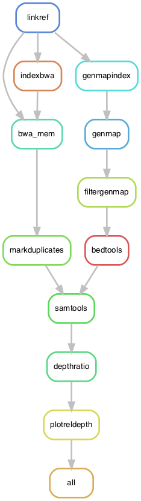

# Looking for copy number variation in the *ENA* gene from PoolSeq data

In this pipeline we are interested in inferring changes in the copy number of a particular gene: *ENA*. This gene exist as a single copy in some *S. cerevisae* strains. In others, there are different number of homologs. For example, in the reference strain S288c there are 3 homologous copies named *ENA1*, *ENA2*, and *ENA5*. From these, *ENA1* is important and characterized as "P-type ATPase sodium pump; involved in Na+ and Li+ efflux to allow salt tolerance". The trio (*ENA1*, *ENA2*, and *ENA5*) seems to have been introgressed from *S. paradoxus* and is present in the European lineage of *S. cerevisae*, including S288c.

Since we used SK1 and Y55 in our experiment, and these strains only have one *ENA* gene, we need to re-map all reads to one of their genomes to try to infer if there were changes in the copy number of these gene during experimental evolution.

## Input files

The paths to the files are hard-code in the pipeline:

	# -------------------------------------------------
	# External files
	REFGenome = "path/to/SK1.genome.fa"

	# BED file with the regions of interest
	bedGENE = "data/ENA_SK1.bed"

	# List of sample's IDs
	filewithIDs = "data/SampleIDs_AdaptationDynamics.txt"

	# Scripts
	ENAdepthCNV = "scripts/ENAdepthCNV.R"
	# -------------------------------------------------

In other words, you need to provide:
	
* Path to the reference genome, which is the SK1 genome from the Liti Lab, [Yue et al. 2017 Nature Genetics](https://www.nature.com/articles/ng.3847)
* A bed file with the coordiantes of the ENA gene in the genome, provided in the repository:

It looks like this:

	chrIV	432983	532983	Left
	chrIV	532984	536259	ENA6
	chrIV	536260	636260	Right

* A single-column file with the names of all the samples used in the experiment, already provided in the repo. In the pipeline there is hard-coded list of samples that get excluded do to contaminations and other issues, but the user doesn't have to do anything. 

* A small plotting script in R `ENAdepthCNV.R`, also provided in the repo

## Building the environment

The pipeline as it is depends on the following modules in UPPMAX:

	$ module load bioinfo-tools snakemake/5.30.1 GATK/4.1.4.1 samtools/1.9

I used [GenMap](https://github.com/cpockrandt/genmap) and this program is not in Uppmax, so it depends on an external conda environment:

	$ cat envs/genmap.yaml
	channels:
	  - bioconda
	  - defaults
	  - conda-forge
	dependencies:
	  - genmap=1.3.0

## Pipeline

Go to working directory if you are not there already:

	$ cd path/to/my/repo
	$ module load bioinfo-tools snakemake/6.9.1 bwa/0.7.17 samtools/1.14 picard/2.23.4 BEDTools/2.29.2 R_packages/4.1.1

First, to get an idea of how the pipeline looks like we can make a rulegraph:

    $ snakemake --snakefile ENAdepthCNV.smk --rulegraph | dot -Tpng > rulegraph.png

To check that the files for the pipeline are in order:

	$ snakemake --snakefile ENAdepthCNV.smk -pn

Run the pipeline:

	$ screen -R bwa
	$ module load bioinfo-tools snakemake/6.9.1 bwa/0.7.17 samtools/1.14 picard/2.23.4 BEDTools/2.29.2 R_packages/4.1.1
	$ snakemake --snakefile ENAdepthCNV.smk -p --cluster "sbatch -A snicXXXX-X-XXX -p core -n {params.threads} -t {params.time} --mail-user xxxxxx@xxxxx.xx --mail-type=ALL" -j 50 --keep-going --use-conda &> snakemake.log &
	[1] 19681

Where `snicXXXX-X-XXX` is your project in UPPMAX and `xxxxxx@xxxxx.xx` is your email.

## About UPPMAX

When running this pipeline, UPPMAX had the following specifications:

	$ hostnamectl
	   Static hostname: rackham2.uppmax.uu.se
	         Icon name: computer-server
	           Chassis: server
	        Machine ID: f911affe94fa4ccb8e6deebe489bdd9b
	           Boot ID: 20854dc584e94630ae6d6860d5e94dd7
	  Operating System: CentOS Linux 7 (Core)
	       CPE OS Name: cpe:/o:centos:centos:7
	            Kernel: Linux 3.10.0-1160.41.1.el7.x86_64
	      Architecture: x86-64

	$ java -version
	java version "1.8.0_151"
	Java(TM) SE Runtime Environment (build 1.8.0_151-b12)
	Java HotSpot(TM) 64-Bit Server VM (build 25.151-b12, mixed mode)

