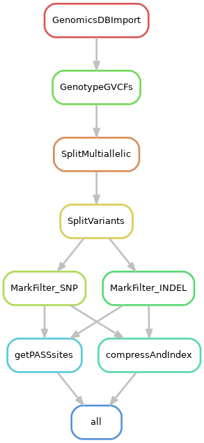

# Calling variants from pre-made gvcf files

For this project, pool sequencing data of diferente populations of *S. cerevisiae* evolving on four different environments were produced. The gvcf files were produced independently from this pipeline. A few samples were discarded based on contamination with *S. paradoxus*, low coverage or potential contamination from within the experiment (based on correlations of allele frequencies at late time points). The excluded samples are:

	LiAc0.01_G1000_R1 --> probably contaminated (correlations)
	LiAc0.01_G1000_R2 --> probably contaminated (correlations)
	LiAc0.01_G1000_R4 --> probably contaminated (correlations)
	LiAc0.01_G1000_R5 --> probably contaminated (correlations)
	LiAc0.02_G1000_R1 --> probably contaminated, shares de novo mutation with NaCl_G1000_R1, MAF is too diverse in G1000
	LiAc0.02_G1000_R2 --> probably contaminated, shares de novo mutation with NaCl_G1000_R1, MAF is too diverse in G1000
	LiAc0.02_G1000_R3 --> probably contaminated, shares de novo mutation with NaCl_G1000_R1, MAF is too diverse in G1000
	LiAc0.02_G1000_R4 --> probably contaminated, shares de novo mutation with NaCl_G1000_R1 MAF is too diverse in G1000
	LiAc0.02_G1000_R5 --> probably contaminated, shares de novo mutation with NaCl_G1000_R1, MAF is too diverse in G1000
	LiAc0.02_G60_R2 --> too low coverage
	NaCl_G1000_R4 --> contamination with paradoxus
	NaCl_G1000_R5 --> contamination with paradoxus
	NaCl_G100_R5 --> contamination with paradoxus
	NaCl_G200_R5 --> contamination with paradoxus
	NaCl_G300_R5 --> contamination with paradoxus
	NaCl_G30_R5 --> contamination with paradoxus
	NaCl_G400_R5 --> contamination with paradoxus
	NaCl_G500_R5 --> contamination with paradoxus
	NaCl_G60_R5 --> contamination with paradoxus
	NaCl_G700_R5 --> contamination with paradoxus
	NaCl_G1000_R1 ---> probably contaminated, shares de novo mutation with LiAc0.01_G1000_R* and a lot of SNPs go back to 50/50 there

	The sample LiAc0.01_G500_R5 failed completely for sequencing

But when I ran this pipeline we had only settle down on these samples:

	LiAc0.01_G1000_R1
	LiAc0.01_G1000_R2
	LiAc0.01_G1000_R4
	LiAc0.01_G1000_R5
	LiAc0.02_G60_R2
	NaCl_G1000_R4
	NaCl_G1000_R5
	NaCl_G100_R5
	NaCl_G200_R5
	NaCl_G300_R5
	NaCl_G30_R5
	NaCl_G400_R5
	NaCl_G500_R5
	NaCl_G60_R5
	NaCl_G700_R5

So the others are removed at later filtering steps in subsequent pipelines (not here).

This pipeline was run on the supercomputer [UPPMAX](https://uppmax.uu.se/), which has a CentOS Linux operating system with a slurm scheduler. However, they should work fine also in other unix environments.

## Data needed for the pipeline

- Folder with gvcf files created with GATK
- The reference genome
- A BED file of the genome to be used as intervals by GATK

The intervals file contains the names of the contigs, the start and the end of their coordinates:

	BK006935.2	0	230218
	BK006936.2	0	813184
	BK006937.2	0	316620
	BK006938.2	0	1531933
	BK006939.2	0	576874
	BK006940.2	0	270161
	BK006941.2	0	1090940
	BK006934.2	0	562643
	BK006942.2	0	439888
	BK006943.2	0	745751
	BK006944.2	0	666816
	BK006945.2	0	1078177
	BK006946.2	0	924431
	BK006947.3	0	784333
	BK006948.2	0	1091291
	BK006949.2	0	948066

The names of the contigs came with the reference genome, but this is the equivalence with chromosome numbers and other IDs:

	Chr	Contig RefSeq_ID	Length
	ChrI	BK006935.2	NC_001133.9	230218
	ChrII	BK006936.2	NC_001134.8	813184
	ChrIII	BK006937.2	NC_001135.5	316620
	ChrIV	BK006938.2	NC_001136.10	1531933
	ChrV	BK006939.2	NC_001137.3	576874
	ChrVI	BK006940.2	NC_001138.5	270161
	ChrVII	BK006941.2	NC_001139.9	1090940
	ChrVIII	BK006934.2	NC_001140.6	562643
	ChrIX	BK006942.2	NC_001141.2	439888
	ChrX	BK006943.2	NC_001142.9	745751
	ChrXI	BK006944.2	NC_001143.9	666816
	ChrXII	BK006945.2	NC_001144.5	1078177
	ChrXIII	BK006946.2	NC_001145.3	924431
	ChrXIV	BK006947.3	NC_001146.8	784333
	ChrXV	BK006948.2	NC_001147.6	1091291
	ChrXVI	BK006949.2	NC_001148.4	948066
	ChrMito	AJ011856.1	NC_001224.1	85779

## Building the environment

The pipeline as it is depends on the following modules in UPPMAX:

	$ module load bioinfo-tools snakemake/5.30.1 GATK/4.1.4.1 samtools/1.9

## Pipeline

This is a pipeline build on the [Snakemake](https://snakemake.readthedocs.io/en/stable/) workflow manager. The paths to the necessary files are on the top of the pipeline and should be changed by the user.

First, to get an idea of how the pipeline looks like we can make a rulegraph:

    $ snakemake --snakefile varcall_adaptation.smk --rulegraph | dot -Tpng > rulegraph.png

To check that the files for the pipeline are in order:

	$ snakemake --snakefile varcall_adaptation.smk -pn

So the pipeline assumes the BAM files are already in said folders.

	$ screen -R varcalling
	$ module load bioinfo-tools snakemake/5.30.1 GATK/4.1.4.1 samtools/1.9
	$ snakemake --snakefile varcall_adaptation.smk -p --cluster "sbatch -A snicXXXX-X-XXX -p core -n {params.threads} -t {params.time} --mail-user xxxxxx@xxxxx.xx --mail-type=ALL" -j 30 --keep-going &> snakemake.log &

## About UPPMAX

When running this pipeline, UPPMAX had the following specifications:

	$ hostnamectl
	   Static hostname: rackham2.uppmax.uu.se
	         Icon name: computer-server
	           Chassis: server
	        Machine ID: f911affe94fa4ccb8e6deebe489bdd9b
	           Boot ID: 20854dc584e94630ae6d6860d5e94dd7
	  Operating System: CentOS Linux 7 (Core)
	       CPE OS Name: cpe:/o:centos:centos:7
	            Kernel: Linux 3.10.0-1160.41.1.el7.x86_64
	      Architecture: x86-64

	$ java -version
	java version "1.8.0_151"
	Java(TM) SE Runtime Environment (build 1.8.0_151-b12)
	Java HotSpot(TM) 64-Bit Server VM (build 25.151-b12, mixed mode)
