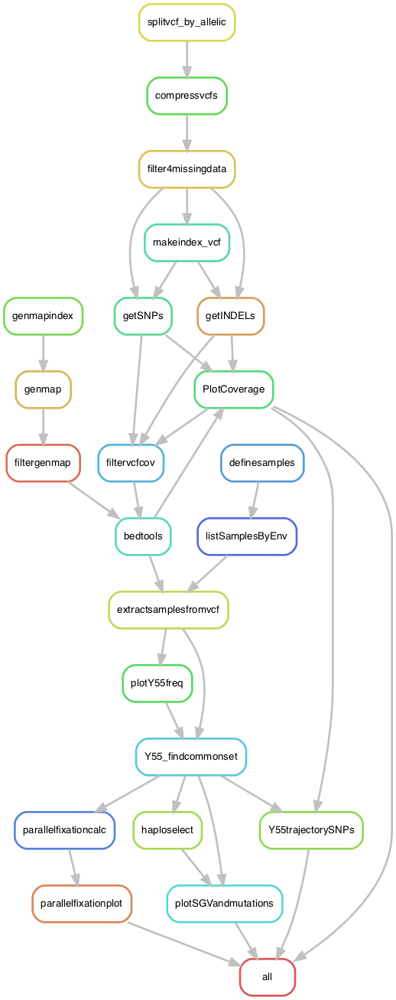

# Analysis of standing genetic variation: vcf4adaptation.smk 

This pipeline contains an updated version of the analyses in [Ament-Velásquez, Gilchrist et al. 2022 bioRxiv](https://www.biorxiv.org/content/10.1101/2022.03.26.485920v1). For this project, pool sequencing data of diferente populations of *S. cerevisiae* evolving in four different environments were produced. First, variants were called with GATK into `g.vcf` files and then processed with the pipeline `varcall_adaptation.smk`. Originally we had also produced a set with the multiallelic sites, but they were not used in the paper in the end.

There are two versions of this pipeline, `vcf4adaptation.smk` and `vcf4adaptation_env.smk`. The former is meant to produce a common set of variants present in all samples to study the dynamics of the standing genetic generation. The latter focus instead in the samples within each environment and attempts to find *de novo* mutations. The final set of manually curated *de novo* mutations is taken by `vcf4adaptation.smk` to plot these mutations on top of the standing genetic generation.

## Input files

This pipeline takes a number of files and a bunch of scripts.

Inputs:

- A vcf files with all the samples from all the environments, already filtered for some minimum quality (as in [`varcall_adaptation.smk`](https://github.com/SLAment/AdaptationDynamics/tree/main/Variant_calling))
- A reference genome (strain S288C, R64; GenBank Accession GCA_000146045.2; provided [here](https://github.com/SLAment/AdaptationDynamics/blob/main/Variant_filtering/PerEnvironment/data/genome.fa) in the repository) in fasta format (we did it all without the mitochondrial contig)
- A file with the names of the contigs and the corresponding chromosome number, found in `../PerEnvironment/data/genome.fa`
- A dataframe in long format with the trajectories of manually curated de novo mutations produced by the pipeline `vcf4adaptation_env.smk` (`deNovoFixers_0.35_trajectories_curated.tab`)

The scripts are available in the folder `scripts` or in the equivalent of the `vcf4adaptation_env.smk`  pipeline, that is `../PerEnvironment/scripts`. The paths to all these files should be specified at the top of the snakemake file (`vcf4adaptation.smk`):

	# External files
	BASEVCF = "../../Variant_calling/All_Variants_parents_PASS.vcf" # Result of that pipeline
	REFGenome = "../PerEnvironment/data/genome.fa"
	chroms = "data/S288C_contigs.txt"
	denovomutations = "../PerEnvironment/results/deNovoFixers_0.35_trajectories_curated.tab"

	# Scripts to massage the data
	vcf4adaptation_vcfR_plotter = "scripts/vcf4adaptation_vcfR_plotter_all.R"
	filtervcfcov = "../PerEnvironment/scripts/filtervcfcov.py"
	getvariantspool = "../PerEnvironment/scripts/getvariantspool.py"
	extractmultivars = "../PerEnvironment/scripts/extractmultivars.py"

	# Plotting
	Y55_along_contigs = "../PerEnvironment/scripts/Y55_along_contigs.R"
	Y55_findcommonset = "scripts/Y55_findcommonset.R"
	haploselect = "scripts/haplocluster.R"
	haplotrajectories = "scripts/haplotrajectories.R"
	Y55trajectorySNPs = "scripts/Y55trajectorySNPs_stats.R"
	ParallelFixation = "scripts/ParallelFixation.R"
	ParallelFixationPlot = "scripts/ParallelFixationPlot.R"

## Building the environment

The pipeline as it is depends on the following libraries in UPPMAX:

	$ module load bioinfo-tools snakemake/5.30.1 bcftools/1.12 vcftools/0.1.16 GATK/4.1.4.1 BEDTools/2.29.2

To plot in R I used the already installed packages. 

	$ module load R_packages/4.1.1

Which is equivalent to using these packages:

	> sessionInfo()
	R version 4.1.1 (2021-08-10)
	Platform: x86_64-pc-linux-gnu (64-bit)
	Running under: CentOS Linux 7 (Core)

	Matrix products: default
	BLAS:   /sw/apps/R/4.1.1/rackham/lib64/R/lib/libRblas.so
	LAPACK: /sw/apps/R/4.1.1/rackham/lib64/R/lib/libRlapack.so

	locale:
	 [1] LC_CTYPE=en_US.UTF-8       LC_NUMERIC=C
	 [3] LC_TIME=en_US.UTF-8        LC_COLLATE=en_US.UTF-8
	 [5] LC_MONETARY=en_US.UTF-8    LC_MESSAGES=en_US.UTF-8
	 [7] LC_PAPER=en_US.UTF-8       LC_NAME=C
	 [9] LC_ADDRESS=C               LC_TELEPHONE=C
	[11] LC_MEASUREMENT=en_US.UTF-8 LC_IDENTIFICATION=C

	attached base packages:
	[1] stats     graphics  grDevices utils     datasets  methods   base

	other attached packages:
	 [1] stringr_1.4.0         rstatix_0.7.0         ggpubr_0.4.0
	 [4] sicegar_0.2.4         spatstat_2.2-0        spatstat.linnet_2.3-0
	 [7] spatstat.core_2.3-1   rpart_4.1-15          nlme_3.1-153
	[10] spatstat.geom_2.3-0   spatstat.data_2.1-0   psych_2.1.9
	[13] reshape2_1.4.4        vcfR_1.12.0           cowplot_1.1.1
	[16] gtools_3.9.2          tidyr_1.1.4           dplyr_1.0.7
	[19] ggplot2_3.3.5

The program [GenMap](https://github.com/cpockrandt/genmap) is not available in Uppmax, so I made a small conda environment for it.

	$ cat envs/genmap.yaml
	channels:
	  - bioconda
	  - defaults
	  - conda-forge
	dependencies:
	  - genmap=1.3.0

## Pipeline

First, go to your working directory. 

To get an idea of how the pipeline looks like we can make a rulegraph:

	$ module load bioinfo-tools snakemake/5.30.1 bcftools/1.12 vcftools/0.1.16 GATK/4.1.4.1 BEDTools/2.29.2 R_packages/4.1.1
    $ snakemake --snakefile vcf4adaptation.smk --rulegraph | dot -Tpng > rulegraph.png

To check that the files for the pipeline are in order:

	$ snakemake --snakefile vcf4adaptation.smk -pn

There are many ways of running the pipeline. One is to make a screen, load the needed packages and call snakemake so it submits slurm jobs as needed. 

	$ screen -R filtering
	$ module load bioinfo-tools snakemake/5.30.1 bcftools/1.12 vcftools/0.1.16 GATK/4.1.4.1 BEDTools/2.29.2 R_packages/4.1.1
	$ snakemake --snakefile vcf4adaptation.smk -p --cluster "sbatch -A snicXXXX-X-XXX -p core -n {params.threads} -t {params.time} --mail-user xxxxxx@xxxxx.xx --mail-type=ALL" -j 30 --keep-going --use-conda &> snakemake.log &

Where `snicXXXX-X-XXX` is your SNIC project and xxxxxx@xxxxx.xx is your email account where you get reports of the job status.

Alternatively, it can be in a sbatch script:

	$ cat snakemake.sh
	#!/bin/bash
	#SBATCH -A snicXXXX-X-XXX
	#SBATCH -J snakemake
	#SBATCH -p node -N 1
	#SBATCH -t 1:00:00
	#SBATCH --output="snakemake-%j.log"
	#SBATCH --error="snakemake-%j.log"

	module load bioinfo-tools snakemake/5.30.1 bcftools/1.12 vcftools/0.1.16 GATK/4.1.4.1 BEDTools/2.29.2 R_packages/4.1.1

	echo "There are $SLURM_JOB_CPUS_PER_NODE nodes available"
	echo

	snakemake --snakefile vcf4adaptation.smk -p --jobs $SLURM_JOB_CPUS_PER_NODE --keep-going --use-conda

And just run:

	$ sbatch snakemake.sh

## Results

The output of the pipeline is a bunch of figures, some for diagnostics (mostly in the output folder `figures`) and some for the paper. In the `results` folder you'll get the most important ones:

- `All_Variants_parents_PASS_bi_miss0_SNPs_25x95p_map1_allenv_shared_clusters_bigbois.pdf` - a bar plot for counts of haplotypes per replicated population. Not used in the paper
- `All_Variants_parents_PASS_bi_miss0_SNPs_25x95p_map1_allenv_shared_clusters_trajectories.pdf` - main figure 3, with the trajectories of haplotypes and de novo mutations

- `CoverageVsPropFixation_delta_SNPs.pdf` - Supplementary Figure 7, exploring the relationship of the proportion of nearly fixed sites and coverage
- `Parallel_count_G100vsG700.pdf` - Supplementary Figure 8, comparing the number of windows fixed for a parental genotype in the environmental parallelism index analysis of generation 100 and 700
- `Parallel_heatmap_G30.pdf` - Supplementary Figure 9, environmental parallelism index of generation 30
- `Parallel_heatmap_G100vsG700.pdf` - Main figure 5, comparing the environmental parallelism index of generation 100 and 700
- `SigmoidalPropFix_SNPs.pdf` - Main figure 4, fitting a sigmoidal curve to the proportion of nearly fixed sites
- `Y55trajectory_SNPs_novo_Ethanol.pdf` - Supplementary Figure 6, with trajectory of all SNPs per chromosome and replicate in Ethanol
- `Y55trajectory_SNPs_novo_LiAc0.01.pdf` - Supplementary Figure 4, with trajectory of all SNPs per chromosome and replicate in LiAc0.01
- `Y55trajectory_SNPs_novo_LiAc0.02.pdf` - Supplementary Figure 5, with trajectory of all SNPs per chromosome and replicate in LiAc0.02
- `Y55trajectory_SNPs_novo_NaCl.pdf` - Supplementary Figure 3, with trajectory of all SNPs per chromosome and replicate in NaCl

## About UPPMAX

	$ hostnamectl
	   Static hostname: rackham2.uppmax.uu.se
	         Icon name: computer-server
	           Chassis: server
	        Machine ID: f911affe94fa4ccb8e6deebe489bdd9b
	           Boot ID: 20854dc584e94630ae6d6860d5e94dd7
	  Operating System: CentOS Linux 7 (Core)
	       CPE OS Name: cpe:/o:centos:centos:7
	            Kernel: Linux 3.10.0-1160.41.1.el7.x86_64
	      Architecture: x86-64

