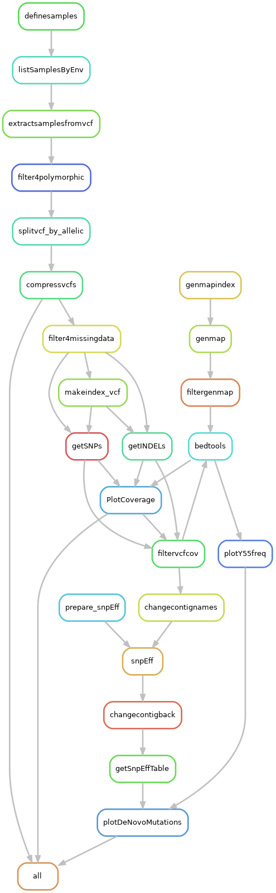
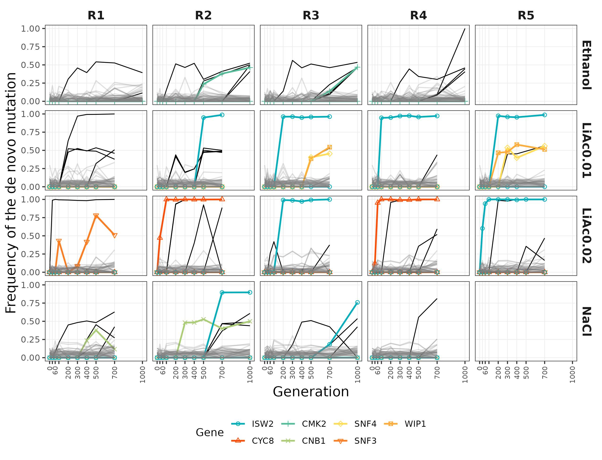
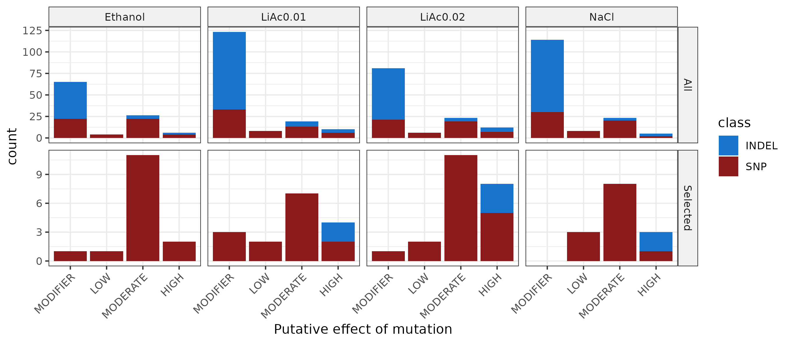

# Analysis of de novo mutations: vcf4adaptation_env.smk 

This pipeline contains the analyses to find *de novo* mutations in a background of standing genetic variation ([Ament-Velásquez, Gilchrist et al. 2022 bioRxiv](https://www.biorxiv.org/content/10.1101/2022.03.26.485920v1)). For this project, pool sequencing data of diferente populations of *S. cerevisiae* evolving in four different environments were produced. First, variants were called with GATK into `g.vcf` files and then processed with the pipeline `varcall_adaptation.smk`. Originally we had also produced a set with the multiallelic sites, but they were not used in the paper in the end.

There are two versions of this pipeline, `vcf4adaptation.smk` and `vcf4adaptation_env.smk`. The former is meant to produce a common set of variants present in all samples to study the dynamics of the standing genetic generation. The latter focus instead in the samples within each environment and attempts to find *de novo* mutations. The final set of manually curated *de novo* mutations is taken by `vcf4adaptation.smk` to plot these mutations on top of the standing genetic generation.

## Input files

This pipeline takes a vcf files with all the samples from all the environments, already filtered for some minimum quality (as in [`varcall_adaptation.smk`](https://github.com/SLAment/AdaptationDynamics/tree/main/Variant_calling)); reference genome (strain S288C, R64; GenBank Accession GCA_000146045.2; provided here in the repository) in fasta format (we did it all without the mitochondrial contig); and a list of manually curated mutations to be removed from the final plots. I produced those by examining mapped reads in the [Integrative Genome Viewer](https://software.broadinstitute.org/software/igv/) v. 2.12.2. Sites with reads mapping to multiple locations, variant caller inconsistencies, and sharp increases in coverage were discarded (30 variants). This file is provided in the folder `data`.

The pipeline also needs a number of python and R scripts, available in `scripts`. The paths to all these files should be specified at the top of the snakemake file (`vcf4adaptation_env.smk`):

	# Data
	BASEVCF = "path/to/All_Variants_parents_PASS.vcf"
	REFGenome = "data/genome.fa"
	bad_mutations = "data/Manually_curated_bad_mutations.txt"

	# Scripts to massage the data
	vcf4adaptation_vcfR_plotter = "scripts/vcf4adaptation_vcfR_plotter_env.R"
	filtervcfcov = "scripts/filtervcfcov.py"
	getvariantspool = "scripts/getvariantspool.py"
	extractmultivars = "scripts/extractmultivars.py"
	snpEff2table = "scripts/snpEff2table.py"

	# Plotting
	Y55_along_contigs = "scripts/Y55_along_contigs.R"
	gb2romanS288C = "scripts/gb2romanS288C.py"
	DeNovoMutations = "scripts/DeNovoMutations.R"

## Bad samples

Due to problems of contamination or low coverage, the following samples were excluded:

	LiAc0.01_G1000_R1 --> probably contaminated, shares de novo mutation with NaCl_G1000_R1
	LiAc0.01_G1000_R2 --> probably contaminated, shares de novo mutation with NaCl_G1000_R1
	LiAc0.01_G1000_R3 --> probably contaminated, shares de novo mutation with NaCl_G1000_R1
	LiAc0.01_G1000_R4 --> probably contaminated, shares de novo mutation with NaCl_G1000_R1
	LiAc0.01_G1000_R5 --> probably contaminated, shares de novo mutation with NaCl_G1000_R1
	LiAc0.02_G60_R2
	NaCl_G1000_R4
	NaCl_G1000_R1 ---> a lot of SNPs go back to 50/50 there

The sample `LiAc0.01_G500_R5` failed completely for sequencing.

The scripts exclude the samples automatically.

## Building the environment

The pipeline as it is depends on the following libraries in UPPMAX:

	$ module load bioinfo-tools snakemake/5.30.1 bcftools/1.12 vcftools/0.1.16 GATK/4.1.4.1 BEDTools/2.29.2

To plot in R I used the already installed packages. 

	$ module load R_packages/4.1.1

Which is equivalent to using these packages:

	cowplot_1.1.1 tidyr_1.1.4   dplyr_1.0.7   ggplot2_3.3.5 vcfR_1.12.0 ggpubr_0.4.0

Some plotting (in the script `DeNovoMutations.R`) won't work with versions of ggplot < 3.3.5 (e.g. 3.3.3)

I also used [snpEff](https://pcingola.github.io/SnpEff/se_running/) v. 5.0. Even tho this program is available in Uppmax, the version is lower and the adequate database for this genome is not there. I don't have writing rights so I can't download it myself. Hence, I made a new [conda](https://docs.conda.io/projects/conda/en/latest/user-guide/install/) environment, but this is done within the pipeline itself using a little environment yaml file:

	$ cat envs/snpEff.yaml
	channels:
	  - bioconda
	  - defaults
	  - conda-forge
	dependencies:
	  - snpeff=5.0

So the user doesn't have to install it or do anything.

Similarly, I used [GenMap](https://github.com/cpockrandt/genmap) and this program is not in Uppmax, so it depends on another external little environment:

	$ cat envs/genmap.yaml
	channels:
	  - bioconda
	  - defaults
	  - conda-forge
	dependencies:
	  - genmap=1.3.0

## Pipeline

First, to get an idea of how the pipeline looks like we can make a rulegraph:
	
	$ module load bioinfo-tools snakemake/5.30.1 bcftools/1.12 vcftools/0.1.16 GATK/4.1.4.1 BEDTools/2.29.2 R_packages/4.0.4

    $ snakemake --snakefile vcf4adaptation_env.smk --rulegraph | dot -Tpng > rulegraph.png

To check that the files for the pipeline are in order:

	$ snakemake --snakefile vcf4adaptation_env.smk -pn

And to run it in a 

	$ screen -R filtering
	$ module load bioinfo-tools snakemake/5.30.1 bcftools/1.12 vcftools/0.1.16 GATK/4.1.4.1 BEDTools/2.29.2 R_packages/4.0.4
	$ snakemake --snakefile vcf4adaptation_env.smk -p --cluster "sbatch -A snicXXXX-X-XXX -p core -n {params.threads} -t {params.time} --mail-user xxxxxx@xxxxx.xx --mail-type=ALL" -j 30 --keep-going --use-conda &> snakemake.log &

Where `snicXXXX-X-XXX` is your SNIC project and xxxxxx@xxxxx.xx is your email account where you get reports of the job status.

Alternatively, it can be in a sbatch script:

	$ cat snakemake.sh
	#!/bin/bash
	#SBATCH -A snicXXXX-X-XXX
	#SBATCH -J snakemake
	#SBATCH -n 3
	#SBATCH -t 2:00:00
	#SBATCH --output="snakemake-%j.log"
	#SBATCH --error="snakemake-%j.log"

	module load bioinfo-tools snakemake/5.30.1 bcftools/1.12 vcftools/0.1.16 GATK/4.1.4.1 BEDTools/2.29.2 R_packages/4.1.1 
	conda activate snpeff

	echo "There are $SLURM_JOB_CPUS_PER_NODE nodes available"
	echo

	snakemake --snakefile vcf4adaptation_env.smk -p --jobs $SLURM_JOB_CPUS_PER_NODE --keep-going --use-conda

And do

	$ sbatch snakemake.sh

## Results

The output of the pipeline is filtered vcf files in various degrees, figures of the filtered vcf files in various formats, and data tables with the allele frequencies of the filtered SNPs, treated even further to exclude sites that are polymorphic in the parental strains Y55 and SK1.

Final filtered vcf files have the following format:
	
	"vcfs/{outputname}_{env}_miss10_var_{typevar}_25x95p.vcf"

Where `outputname` relates to the name of the input vcf file, `env` is the different environment in the experiment (NaCl, Ethanol, LiAc0.01 and LiAc0.02), and `typevar` is either SNPs or INDELs. They sit in the folder `vcfs`.

There are several figures derived from those files:

- Coverage distributions before and after filtering for at least 25x and no more than the 95th percentile, for both SNPs and INDELs. 
- Plot of the Y55 allele frequency in windows (10Kb windows with at least 2 SNPs) along the chromosomes, with only the founder and the 700 generations, but only the SNPs

Associated to the figures there are several tables containing the data for the plots (the pipeline puts them in the folder `data`):

- Coverage stats before and after filtering for SNPs and INDELs
- Table with MAF window (5Kb windows with at least 5 SNPs) values for SNPs and INDELs
- Table with the Y55 allele frequency values in windows (10Kb windows with at least 2 SNPs) for SNPs: `*SNPs_25x95p_map1_Y55freq_win.tab`
- Table with the Y55 allele frequency values per SNP, after filtering out sites that were not variable in the ancestor: `*SNPs_25x95p_map1_Y55freq_var.tab`
- Table with the Y55 allele frequency values per SNP, including sites that were not variable in the ancestor, and hence appear as f(Y55) close or at 1: `*SNPs_25x95p_map1_Y55freq_all_var.tab`. This one makes it looks as if those big chunks got fixed for Y55, but it's only because Y55 = SK1 from the beginning. They also contain the de novo mutations!
- Similar tables for INDELs.

But the real results of the pipeline are, of course, in the `results` folder:

- deNovo_all_0.1_CoolGenes.pdf -- The Figure 6 in the [bioRxiv manuscript](https://www.biorxiv.org/content/10.1101/2022.03.26.485920v1).

- deNovoFixers_0.35_genes_4stringdb.txt -- The list of genes used as input for the [STRING database](https://string-db.org/cgi/network?taskId=bELrKuOvTs6q&sessionId=bWoDGnbyDEkf&allnodes=1), used to produce Figure 5 in the BioRxiv.
- deNovoFixers_0.35_SNPeff.pdf -- Supplementary Figure 7 in the BioRxiv with the distribution of effects of the de novo mutations.

- deNovoFixers_0.35_trajectories_curated.tab -- A data frame (long format) with the trajectory data of the curated de novo mutations. Used by `vcf4adaptation.smk`.
- deNovoFixers_0.35_trajectories_raw.tab -- A data frame (long format) with the trajectory data of de novo mutations before manual curation.
- deNovoGenesINFO_fixers_0.35.tab -- a table with the de novo mutation variants and their respective effects extracted from snpEff.

Some of these `results` files are provided here in the repository for convenience of the user.

## About UPPMAX

When running this pipeline, UPPMAX had the following specifications:

	$ hostnamectl
	   Static hostname: rackham3.uppmax.uu.se
	         Icon name: computer-server
	           Chassis: server
	        Machine ID: dee8e88d3c6a4fa68334e18556ae967b
	           Boot ID: 30c307e11d174a75a49c4c2f1a12df55
	  Operating System: CentOS Linux 7 (Core)
	       CPE OS Name: cpe:/o:centos:centos:7
	            Kernel: Linux 3.10.0-1160.59.1.el7.x86_64
	      Architecture: x86-64
